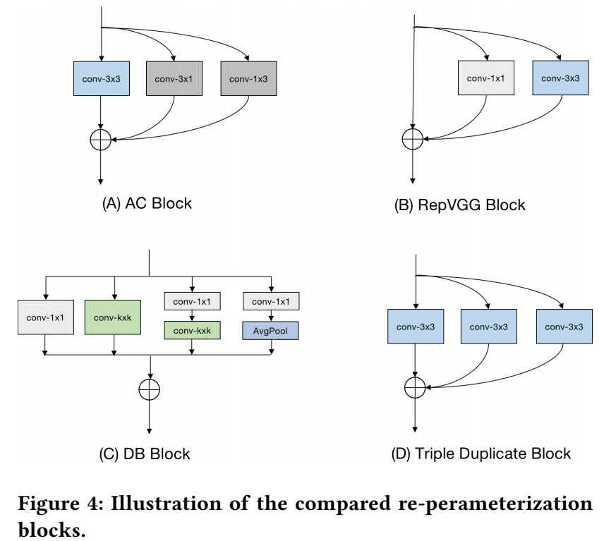

重参数化相关的论文:

**ACNet2019** ACNet: Strengthening the Kernel Skeletons for Powerful CNN via Asymmetric Convolution Blocks

**DB_block2021** Diverse Branch Block: Building a Convolution as an Inception-like Unit

**RepMLP2021** RepMLP: Re-parameterizing Convolutions into Fully-connected Layers for Image Recognition

**RepVGG2021** RepVGG: Making VGG-style ConvNets Great Again

**ResRep2021** ResRep: Lossless CNN Pruning via Decoupling Remembering and Forgetting

**MM21_ECBSR** Edge-oriented Convolution Block for Real-time Super Resolution on Mobile Devices

**ParNet2021** NON-DEEP NETWORKS

**RMNet2021** RMNET: EQUIVALENTLY REMOVING RESIDUAL CONNECTION FROM NETWORKS

几种重参数化的结构:

ref:
[ACNet续作——CVPR2021:Diverse Branch Block](https://zhuanlan.zhihu.com/p/360939086)
[结构重参数化：利用参数转换解耦训练和推理结构](https://zhuanlan.zhihu.com/p/361090497)

